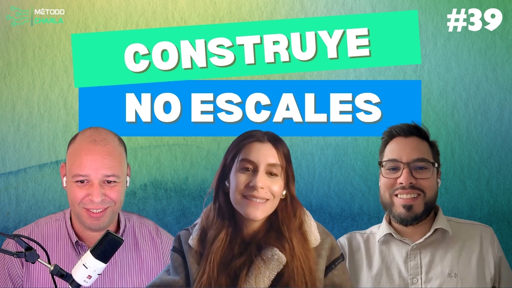

# Startups, datos y liderazgo: descubre el Colombia Tech Report 2025

María Paula Peñaranda es diseñadora industrial de la Pontificia Universidad Javeriana, especialista en marketing estratégico del CESA y gerente de Innovación en KPMG Colombia, donde lidera la articulación de servicios financieros, legales y tributarios para hacer escalar startups de forma sostenible. Referente del ecosistema tech latinoamericano, dirigió el Colombia Tech Report 2024-2025, estudio que mapeará más de 2.100 startups y guía la toma de decisiones de corporativos, academia y gobierno. Con más de ocho años impulsando innovación, datos y liderazgo femenino, nos acompaña hoy desde Bogotá para hablar de alianzas público-privadas, cultura startup y cómo convertir la data en impacto real.

> Un espacio donde la experiencia se encuentra con la innovación. Jesús León y Gerswin Pineda, dos profesionales con una trayectoria impresionante en el mundo de la tecnología, te invitan a dialogar sobre las tendencias que están definiendo nuestra era digital. Cada episodio es una oportunidad para aprender de invitados expertos y descubrir cómo la tecnología transforma nuestras vidas. Únete a la conversación y amplía tus horizontes con “Método Charla”.

## SUSCRÍBETE AL CANAL:

## CONTÁCTANOS SI QUIERES PARTICIPAR:

## ¡SÍGUENOS EN!:

